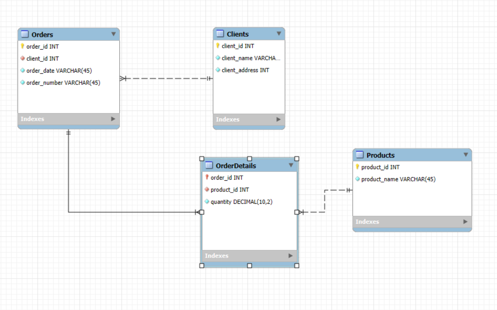

# Database Design: Orders System (3NF)

This project demonstrates the process of normalizing a relational database schema to the **Third Normal Form (3NF)** using MySQL Workbench.

---

## 📌 Structure

### Tables:

#### 1. `clients`
- `client_id` (Primary Key)
- `client_name`
- `client_address`

#### 2. `orders`
- `order_id` (Primary Key)
- `client_id` (Foreign Key → clients.client_id)
- `order_date`

#### 3. `products`
- `product_id` (Primary Key)
- `product_name`

#### 4. `orderdetails`
- `order_id` (Foreign Key → orders.order_id)
- `product_id` (Foreign Key → products.product_id)
- `quantity`

---

## 🔗 Relationships

- One client can make multiple orders (1:N)
- One order can contain multiple products (M:N via `orderdetails`)
- Each orderdetails record links a product to a specific order

---

## ✅ Normal Forms Achieved

- **1NF**: Atomic values (e.g., no lists in a single field)
- **2NF**: Removed partial dependencies (split into related tables)
- **3NF**: Removed transitive dependencies (products stored separately)

---

## 🖼 Screenshots

### 📌 Step 1: Initial Table → 1NF

### 📌 Step 2: 2NF with Clients & Orders separated

### 📌 Step 3: 3NF with Products moved to a new table

### 📌 Final Navigator View in Workbench

---

## 🛠 Tools

- MySQL Workbench
- EER Diagram Designer
- Manual schema creation and normalization

---

## 🧠 Author

Designed and normalized step-by-step by **Anton Babenko** as part of GoIT DB course homework.
